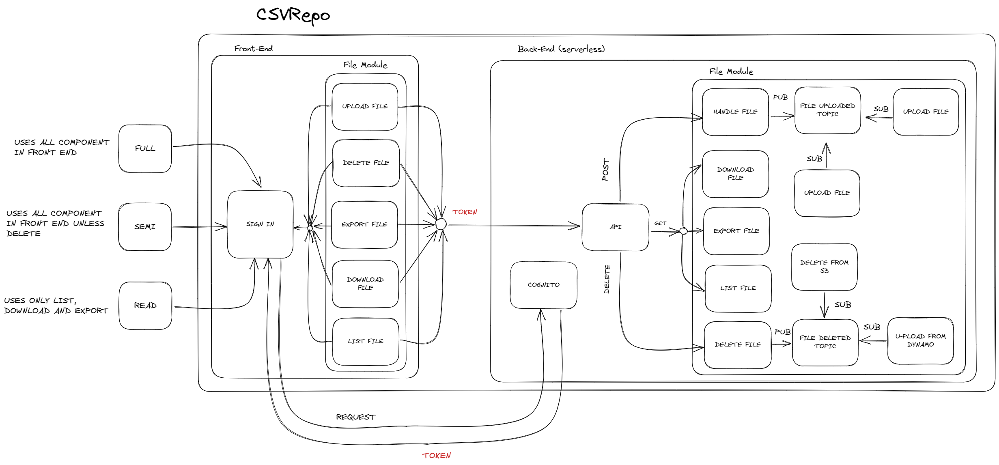
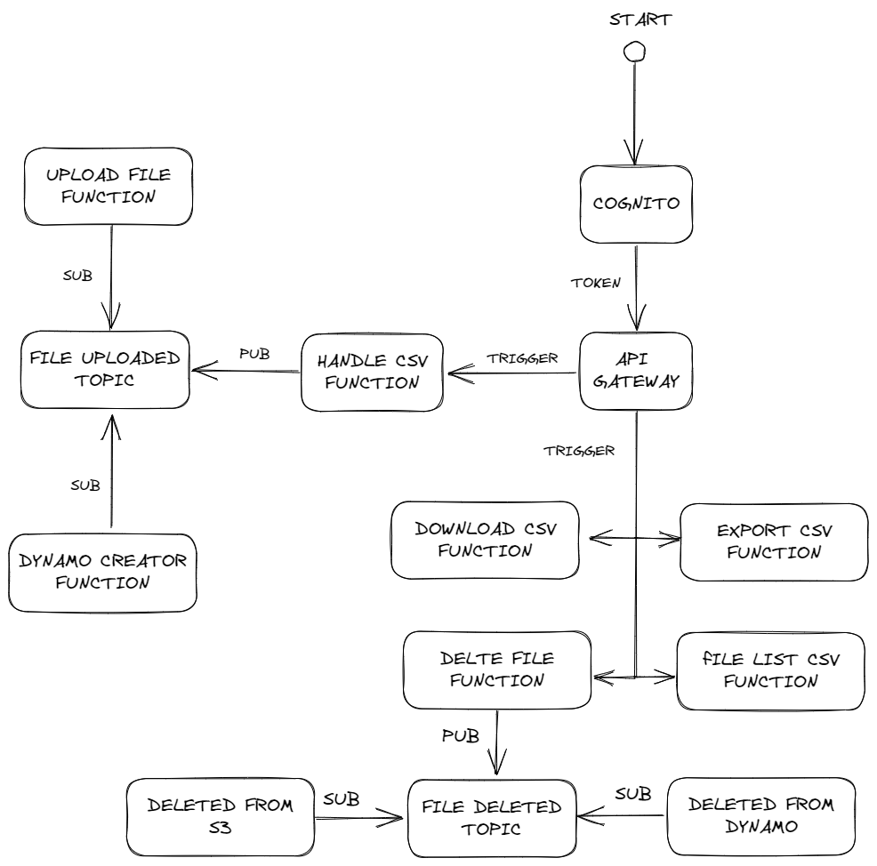

# CSVRepoTemplate

This project was generated with [Angular CLI](https://github.com/angular/angular-cli) version 15.2.6.

## Development server

Run `ng serve` for a dev server. Navigate to `http://localhost:4200/`. The application will automatically reload if you change any of the source files.

## Code scaffolding

Run `ng generate component component-name` to generate a new component. You can also use `ng generate directive|pipe|service|class|guard|interface|enum|module`.

## Build

Run `ng build` to build the project. The build artifacts will be stored in the `dist/` directory.

## Running unit tests

Run `ng test` to execute the unit tests via [Karma](https://karma-runner.github.io).

## Running end-to-end tests

Run `ng e2e` to execute the end-to-end tests via a platform of your choice. To use this command, you need to first add a package that implements end-to-end testing capabilities.

## Further help

To get more help on the Angular CLI use `ng help` or go check out the [Angular CLI Overview and Command Reference](https://angular.io/cli) page.

# CSVRepo

This project was developed using Angular and various AWS services such as AWS Lambda functions, DynamoDB, Cognito, and API Gateway. The purpose of the application is to provide a simple and efficient way for users to upload CSV files and view the uploaded files, and export them to JSON format.

The application is designed to be user-friendly and secure, with authentication provided by Cognito and access control enforced by API Gateway. DynamoDB is used to store file contents , while Lambda functions are used to handle file uploads and exports.

## Component and AWS Services Diagram

### Component Diagram

### Design Diagram

## Features

- User authentication and authorization
- File upload and export
- File metadata and information storage
- File download
- File deletion

## Solution
first of all, we need to create a user pool in Cognito, and then create a client application for the user pool. The client application will be used to authenticate users and generate tokens for accessing the API Gateway endpoints.
then I made a lambda function to handle the file upload, and publish a message for the sns topic to notify the upload to s3 and dynamo  and then i made a lambda function to handle the file export it exports the file into json format,
then I made a lambda function to handle the file deletion, and publish a message for the sns topic to notify the deletion to s3 and dynamo.

## AWS Services

- Cognito
- API Gateway
- Lambda
- DynamoDB
- S3
- SNS
- CloudWatch

## AWS Lambda Functions
- handle-csv
- upload-csv
- dynamo-creation
- export-csv
- handle-delete
- delete-from-s3
- delete-from-dynamo
- download-csv
- files-list

## AWS API Gateway Endpoints
- POST /api/v1/file - Upload a file
- GET /api/v1/file - Get all files
- GET /api/v1/file?fileName={fileName} - Get a file by file name
- GET /api/v1/file/export?fileName={fileName} - Export a file by file name
- DELETE /api/v1/file?fileName={fileName} - Delete a file by file name
## AWS S3 Buckets
- csvrepo-loai

## AWS SNS Topics
- uploaded-file
- deleted-file

